# 🚀 SPK Pemilihan Karyawan Terbaik - Metode MOORA
### Studi Kasus: Restoran Melita Kitchen
## 📝 Deskripsi
Sistem Pendukung Keputusan berbasis Laravel untuk pemilihan karyawan terbaik menggunakan metode Multi Objective Optimization on the Basic of Ratio Analysis (MOORA). Sistem ini terintegrasi dengan [aplikasi mobile absensi](https://github.com/okedane/aplikasi-absensi-flutter) untuk memudahkan proses pencatatan kehadiran karyawan.
## 🔄 Arsitektur Sistem

### Flowchart System
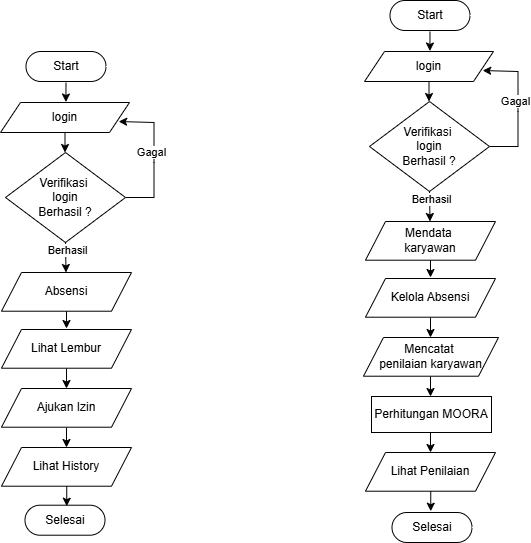

### Use Case Diagram
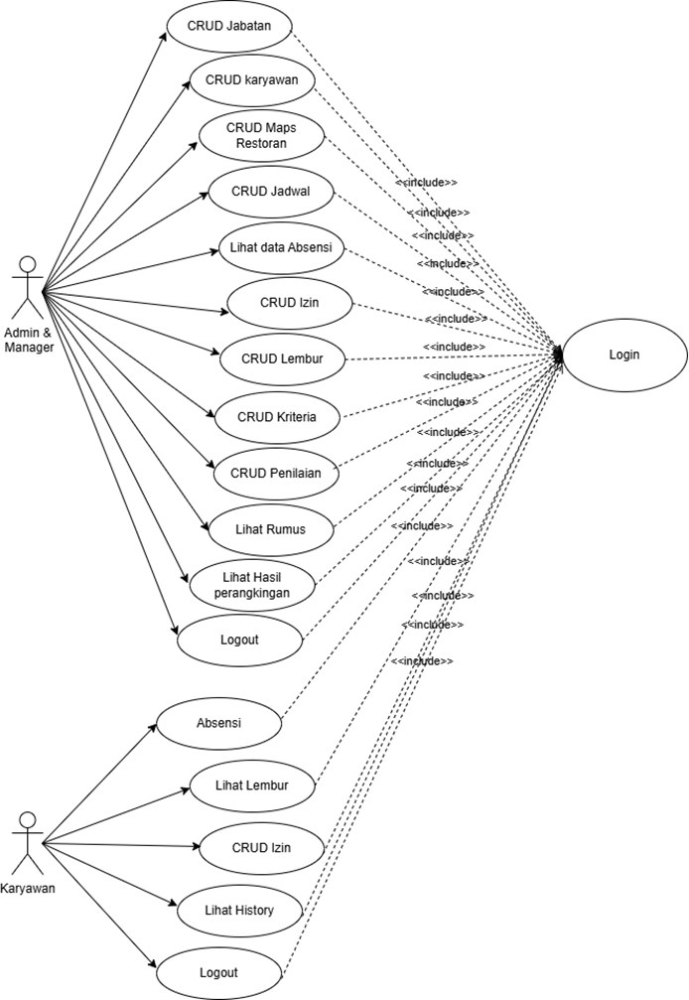

### Database Design
<details>
<summary>📊 CDM & PDM</summary>

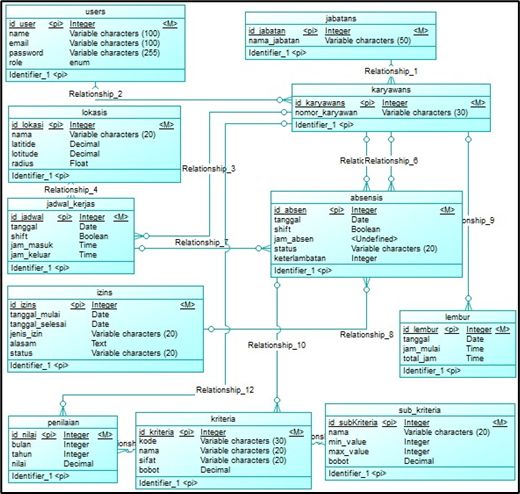
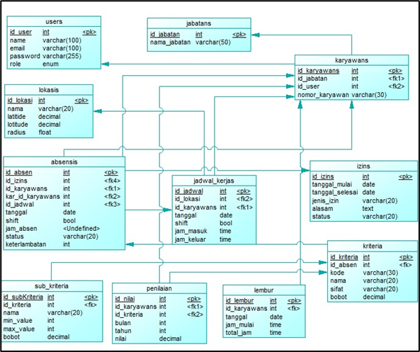
</details>

## 🖥️ Fitur Utama
- Manajemen Karyawan
- Sistem Absensi
- Pengajuan Izin & Lembur
- Penilaian Karyawan
- Perhitungan MOORA
- Multi-role User System

## 📸 Interface
<details>
<summary>Screenshots Aplikasi</summary>

### Autentikasi
| Login | Reset Password |
|:-------------------------:|:-------------------------:|
|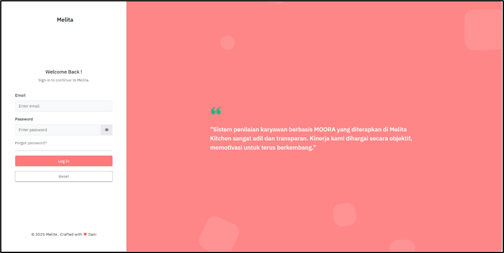|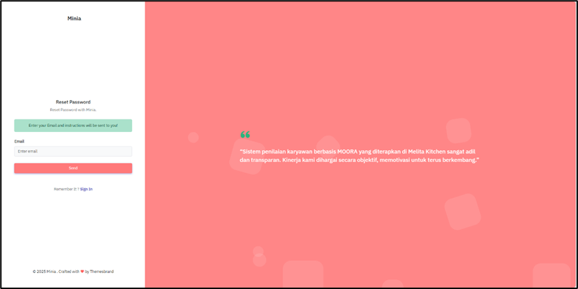|

### Core Features
| Dashboard | Jabatan | Karyawan |
|:-------------------------:|:-------------------------:|:-------------------------:|
|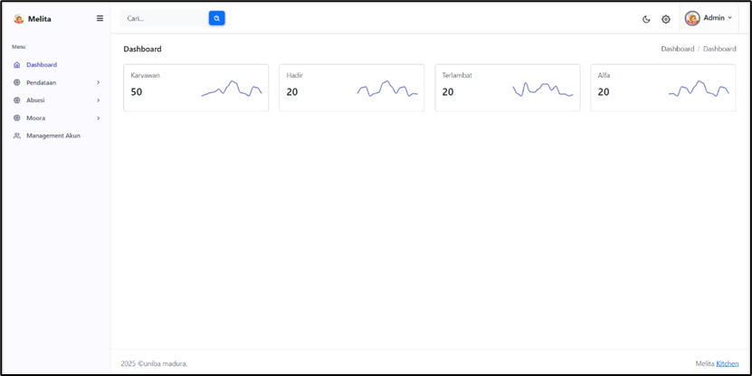|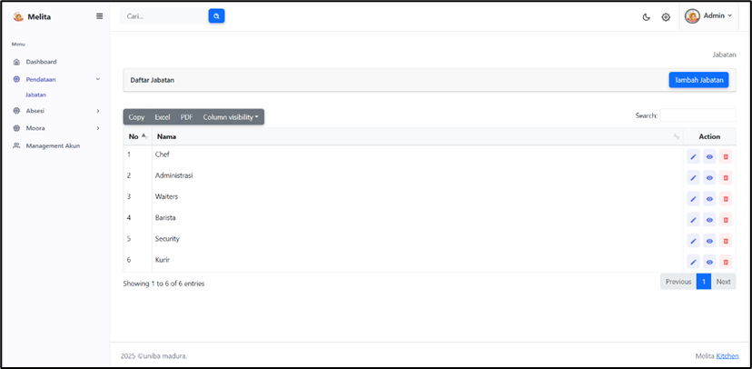|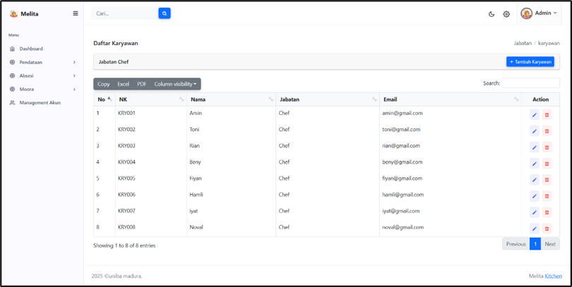|

### Manajemen Absensi
| Lokasi | Jadwal | History |
|:-------------------------:|:-------------------------:|:-------------------------:|
|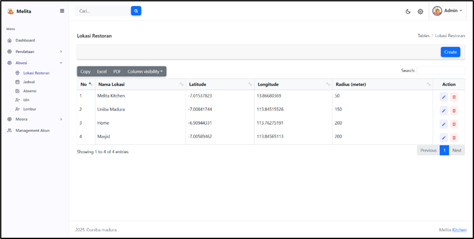|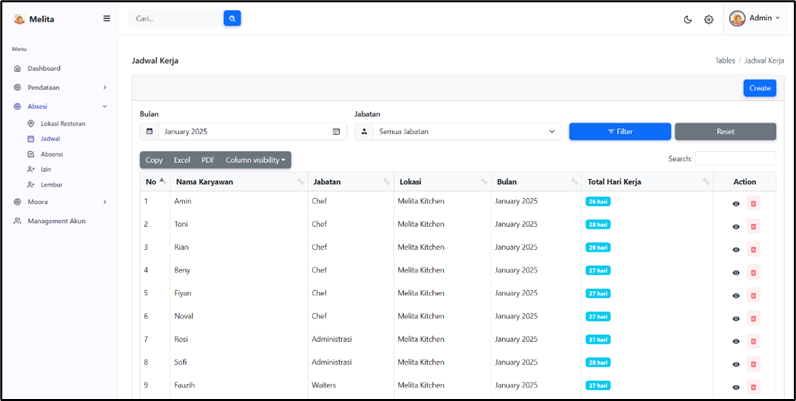|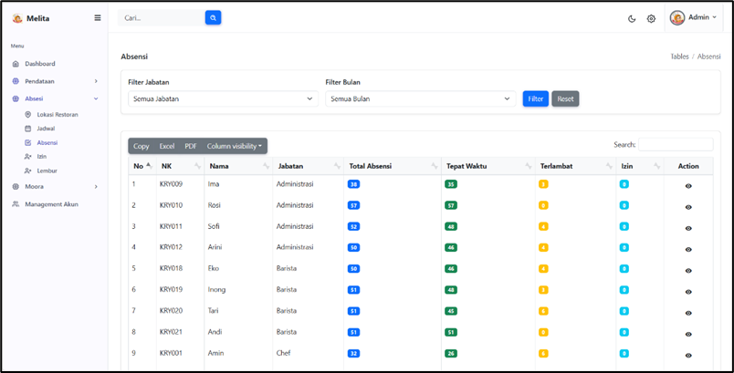|

### Pengajuan
| Izin | Lembur |
|:-------------------------:|:-------------------------:|
||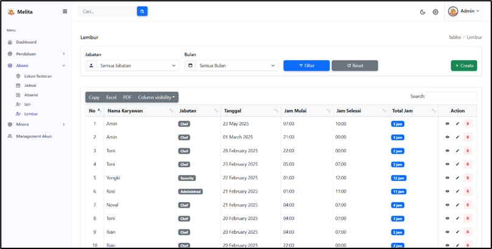|
### Penilaian & Perhitungan
| Kriteria | Sub Kriteria | Penilaian |
|:-------------------------:|:-------------------------:|:-------------------------:|
|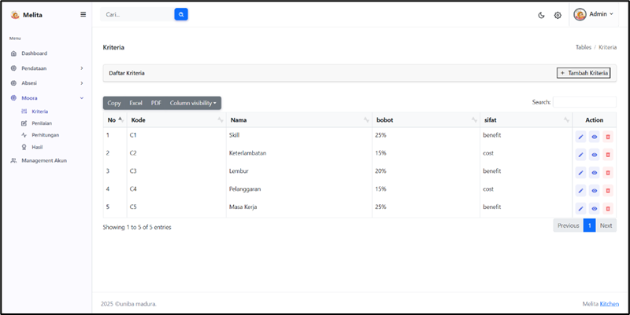|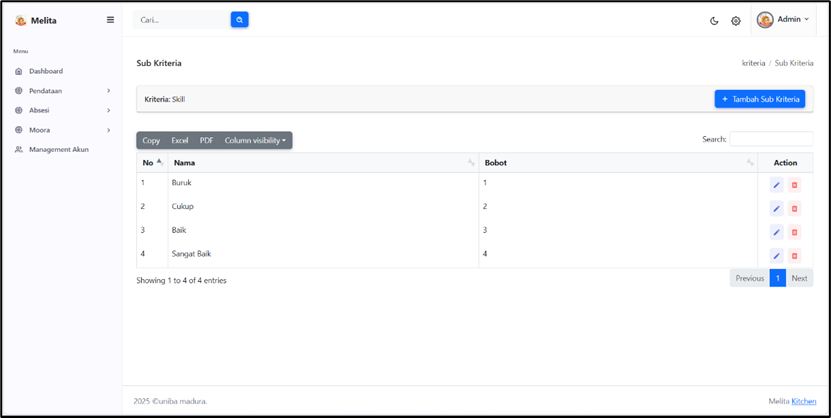|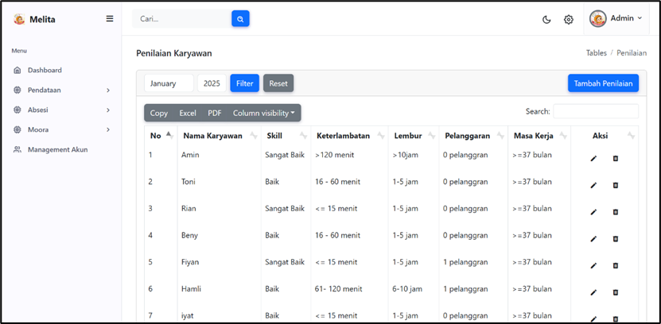|

| Perhitungan | Peringkat |
|:-------------------------:|:-------------------------:|
|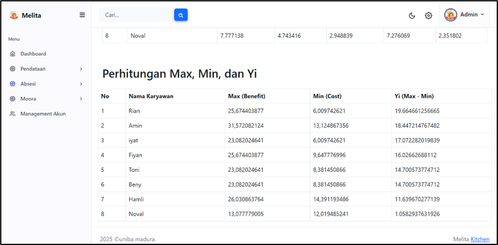|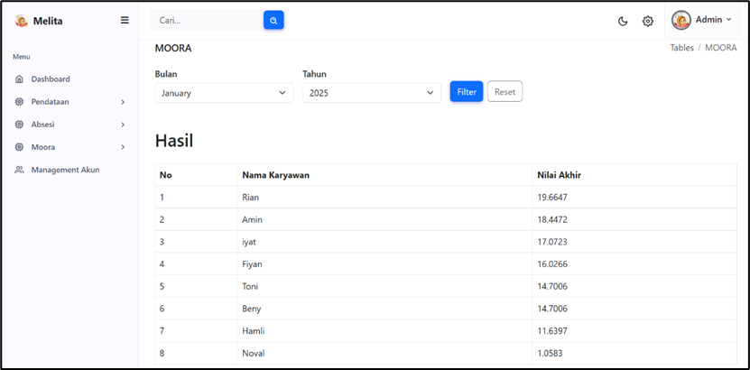|

</details>

## ⚙️ Instalasi

```bash
# Clone repository
git clone [url-repository]

# Install dependencies
composer install

# Setup environment
cp .env.example .env
php artisan key:generate

# Migrate database
php artisan migrate:fresh --seed
```

## 🔑 Akses Default
```
Admin Account
Email: romadani.code@gmail.com
Password: 12345678
```

## 📄 Data Pendukung
[file Pendukung](readme/skripsi.pdf)

## 👨‍💻 Developer
- Nama: okedane
- GitHub: [RomaCode](https://github.com/okedane)
- Email: romadani.code@gmail.com
